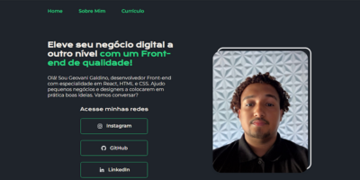

# 🌟 Meu Primeiro Portfólio

## 📖 Descrição

Este é o meu **primeiro portfólio**, criado como parte dos cursos de **HTML** e **CSS** da **Alura**. O objetivo principal deste projeto é demonstrar as habilidades que adquiri no desenvolvimento **front-end**, utilizando as tecnologias **HTML** e **CSS**.

## 📂 Conteúdo do Portfólio

O portfólio é composto por três páginas principais:

- **🏠 Home:** Uma página de apresentação com informações sobre mim e links para minhas redes sociais.
- **👤 Sobre Mim:** Uma página com uma descrição sobre minha trajetória, paixão por tecnologia e metas de aprendizado.
- **📄 Currículo:** Uma página com informações sobre minhas experiências, cursos e habilidades.

## 🛠️ Tecnologias Utilizadas

- **HTML5**
- **CSS3**

## 🔗 Acesso

Você pode acessar o meu portfólio através do seguinte link: [Meu Portfólio](https://geovanigaldino.github.io/portfolio-alura/)

## 🌐 Redes Sociais

- [Instagram](https://www.instagram.com/geovaniigs/)
- [GitHub](https://github.com/geovanigaldino)
- [LinkedIn](https://www.linkedin.com/in/geovanigaldino/)

## 🙏 Agradecimentos

Gostaria de agradecer à **Alura** pelos excelentes cursos que me proporcionaram as habilidades necessárias para criar este portfólio.

## 📜 Licença

Este projeto está sob a licença **MIT**. Consulte o arquivo [LICENSE](LICENSE) para obter mais informações.
